# rime-TswG
自用rime-lua腳本及方案分享

## usage

`rime-TswG-example.schema.yaml`是帶有腳本的樣例方案。使用明月拼音的碼表

建議另外用一個文件夾並設作用戶文件夾㕥測試(即按下文的步驟)、無問題後再參照樣例方案按需引入你自己的方案裏。否則可能容易踩坑

體驗rime-TswG-example:

要求: librime-lua 版本 >= 200

### windows 小狼毫:

版本 >= 0.15.0


0. 執行以下命令
```
git clone https://github.com/Tsinswreng/rime-TswG.git #或者手動下載
cd rime-TswG
npm i clipboardy #可選
```
1. 退出算法服務

2. 把當前的用戶文件夾改名、假設你的用戶文件夾爲`User_Data` 則可改名作`_User_Data`

3. 用 從此倉庫下載下來的代碼文件夾 代替 原本的用戶文件夾 (名稱, 路徑要一致)

4. 重新開啓算法服務、並在輸入法設定選中`rime-TswG-example`

5. 重新部署

6. 按`F4`或ctrl+\` 打開輸入法選單、選中`rime-TswG-example`

7. 完成。


測試無問題後再參照樣例方案按需引入你自己的方案裏。參照每個lua模塊的開頭的說明。注意require的文件必須要存在于lua/目錄下。否則腳本不能正常運行。

* Android 同文:

仿照windows 小狼毫的安裝流程、或先在電腦上跑通後再遷移到同文上

* linux macos:

沒試過 自己摸索罷()

**歡迎提出問題或想法**

## 內容

lua腳本模塊:
* init.lua 用于初始化配置
* predict.lua 動態聯想詞
* userWordCombiner.lua 輸入歷史組詞記入詞庫
* cmd.lua 命令、當前支持開關轉換, 輸出unicode字符, 輸出lua表達式(可當計算器用), 讀取剪貼板處理內容後輸出(簡繁轉換,字串反轉,豎排等)
* jp.lua 繁轉日
* getSingleCharFromPhrase.lua 以詞定字
* hintTrad.lua 簡體模式下提示傳統漢字
* fillMenu.lua 單字組詞出候選
* deleteSelectionOn0.lua 0鍵刪詞
* filterOnAddtionalCode.lua 針對使用輔助碼旹的filter(僅用于dks方案)
* limitFilter.lua 置于filters最前面㕥限制filter中候選詞的數量、㕥防後續filter處理過多不需要的候選
* time_translator.lua 輸出當前時間
<!-- * clearOnKey.lua 按住shift+退格 清空輸入(原爲清除一個分段) -->
* clearOnKey.lua 按下shift又直接松開旹 清空菜單


工具等:
* config.lua 用戶配置
* shared.lua 跨模塊共享變量/函數
* type.lua librime-lua類型聲明
* ArrayDeque.lua 循環數組雙端隊列
* HistoryDeque.lua 繼承ArrayDeque用于錄限定個數的輸入歷史
* ut.lua 工具
* algo.lua 算法工具
* rimeUtil.lua 輸入法工具

方案: 
* prd 僅用于部署後生成靜態聯想詞詞庫給lua腳本調用
* dks 魔改上古音三拼 (待分享)
* cangjie7-1 魔改三碼倉頡 (待分享)

## lua 模塊

### predict.lua

聯想詞。支持動態聯想

開啓後、每次上屏後自動在菜單中顯示聯想候選詞。

當已經顯示聯想詞旹:
* 使用空格或數字鍵(1-9)可以直接使聯想詞上屏。
* 按0鍵刪除當前高亮候選。
* 按上下箭頭可使其他候選項變高亮 (即默認行爲)

除此之外、所有的按鍵事件都會使聯想詞菜單消失。

聯想詞菜單不會干擾後續正常打字。
<!-- 若此時希望繼續打字而不是上屏聯想詞則可忽視、直接按其他按鍵即可。 -->

使用HistoryDeque.lua、默認容量爲4

靜態聯想詞庫來自處理後的`essay.txt`

用戶動態聯想詞詞庫名稱默認爲`prd`

大致算法:

來自動態聯想詞庫候選詞權重更大;

<!-- 設用戶已經依次上屏了`["春","眠","不"]`三個字、當用戶再上屏`覺`字旹、歷史隊列會記錄`["春","眠","不","覺"]` -->
若用戶輸入了`春眠不覺`四個字(無論是一次性上屏輸入還是逐字分四次上屏輸入)則程序用以下字串去查字典:

`春眠不覺` `眠不覺` `不覺` `覺`

越靠前的字串、若有查找結果則所得候選詞權重越高

(下圖是gif)

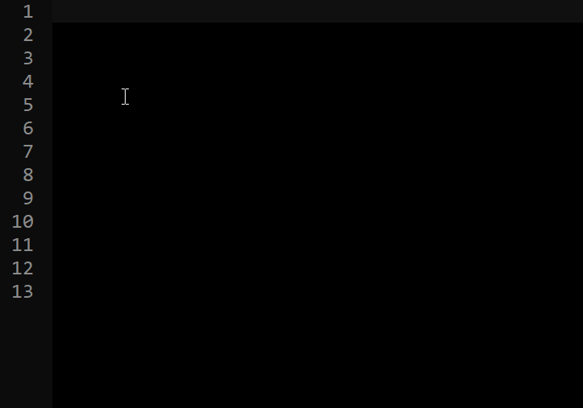

註釋可關

(下圖是gif)


同文

(gif)


已知bug:
* 小狼毫0.15.0 按數字鍵2欲擇第二個聯想候選項旹 菜單直接消失 (同文運行相同腳本無此bug)


### userWordCombiner.lua

使用HistoryDeque.lua。默認容量爲4。

根據用戶輸入歷史組詞並寫入動態用戶詞庫

如 依次上屏`["輸","入","歷","史"]`四個字則會將
```
["輸入歷史", "入歷史", "歷史"]
```
記入當前方案所使用的userdb。下次可只需按`srls`(假設用的方案是拼音)即可使`輸入歷史`顯于候選

示例:

按照rime默認行爲、須一次性上屏`氓之蚩蚩`四個字旹 輸入法纔會將`氓之蚩蚩`錄入用戶詞典。若分開逐字上屏則不會把`氓之蚩蚩`一詞錄入用戶詞典。

(gif)

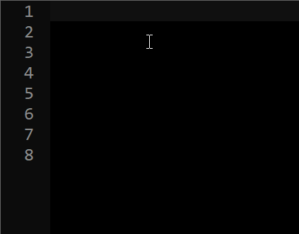

使用此插件後

第一次輸入`mtee`旹 候選項中無`氓之蚩蚩`

逐字上屏`氓`,`之`,`蚩`,`蚩`後再輸入`mtee`旹可見`氓之蚩蚩`已現于候選首位、即`氓之蚩蚩`已被錄入用戶詞典。

但是、在此過程中並非只有`氓之蚩蚩`一詞被錄入了用戶詞典。以下標黃的字串也會被錄入用戶詞典

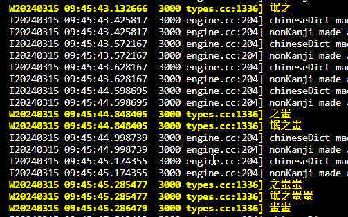

有些詞並不是我們想要的。因此 **此插件可能污染用戶詞庫。請慎用**

默認配置:
 * 不錄單字
 * 上屏歷史雙端隊列容量爲4。

### jp.lua

繁轉日

開啓後:

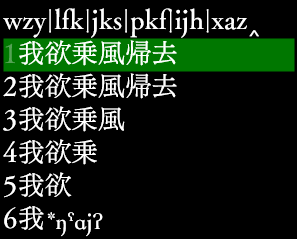

`乘`->`乗`

`歸`->`帰`

### cmd.lua
命令

默認配置:引導符`$`、參數分隔符`,`、空格提交命令


#### 快捷開關:

 * 簡體模式:

開: `$s`

關: `$S`

(下圖是gif)


全角:

開: `$fu`

關: `$Fu`

日語新字體(需要部署jp.lua):

開: `$jp`

關: `$Jp`

聯想詞(需要部署predict.lua):

開: `$p`

關: `$P`


#### 輸出表達式等

* 以十六進制上屏unicode字符

`$u,4e2d` -> `中`

(下圖是gif)

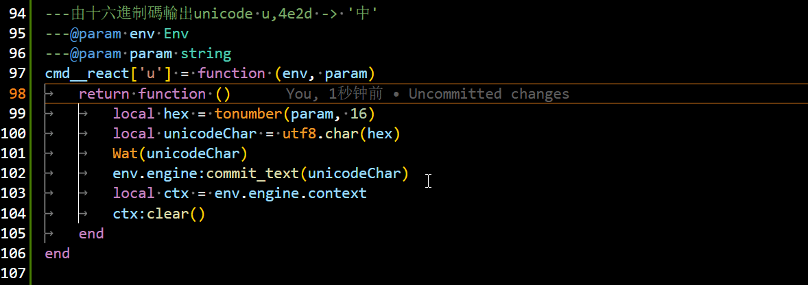

* 上屏lua表達式(可當簡易計算器用)

`$l,2-3` -> `-1`

`$l,math.log(5)` -> `1.6094379124341`

(下圖是gif)

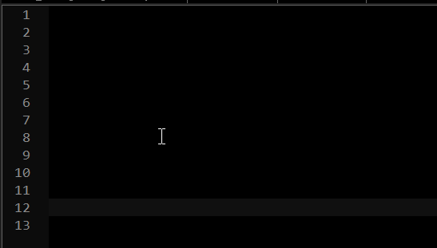


#### 處理剪貼板後上屏

依賴clipboard.lua

需要node.js

在用戶文件夾根目錄運行
```
npm i clipboardy
```
(只在windows10上測試過、直接用`powershell.exe -command "Get-Clipboard"`總是卡死、所以改用npm的clipboardy庫)

獲取剪貼板的原理: lua通過`os.execute`使操作系統將剪貼板內容寫入預定的文件、然後lua讀取該文件

使用旹 閃過cmd是正常現象

**警告:字符過多旹輸入法和當前聚焦的窗口會卡死、需要退出算法服務**


* 字體轉換並粘貼

`$v,` 後接`opencc`目錄中的json文件名

`t`:繁體; `s`: 簡體; `jp`: 日語新字體; `2`: to

如`$v,t2s` 對剪貼板內容繁轉簡後上屏

(下圖是gif)

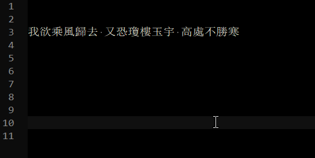

* 剪貼板字串逆序上屏

`$r`

(下圖是gif)

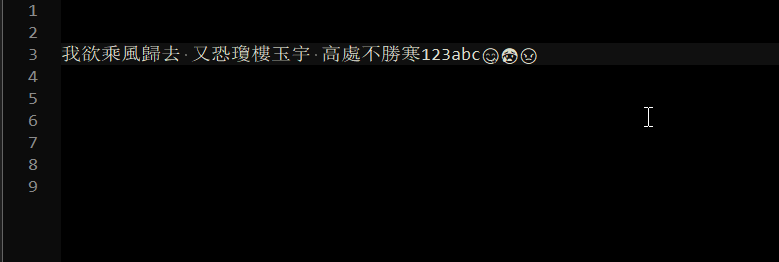

* 豎排右換行分段輸出

`$f,vr,4,8` 每列最多4個字符、每段最多8列(若不指定則無限制)

`$f,vrf,4,8` 若第二個參數用`vrf`而非`vr`則會將其中含有的ascii字符轉全角

`$fv,4,8` 等同於 `$f,vrf,4,8`

不分段示例:

`$fv,7`:

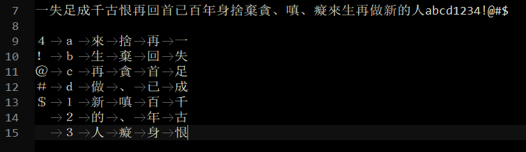

分段示例:

原文:
```
天生萬物以養民，民無一善可報天。不知蝗蠹遍天下，苦盡蒼生盡王臣。人之生矣有貴賤，貴人長為天恩眷。人生富貴總由天，草民之窮由天譴。忽有狂徒夜磨刀，帝星飄搖熒惑高。翻天覆地從今始，殺人何須惜手勞。不忠之人曰可殺！不孝之人曰可殺！不仁之人曰可殺！不義之人曰可殺！不禮不智不信人，大西王曰殺殺殺！我生不為逐鹿來，都門懶築黃金台，狀元百官都如狗，總是刀下觳觫材。傳令麾下四王子，破城不須封刀匕。山頭代天樹此碑，逆天之人立死跪亦死！ab12!@
```
`$fv,8,9`

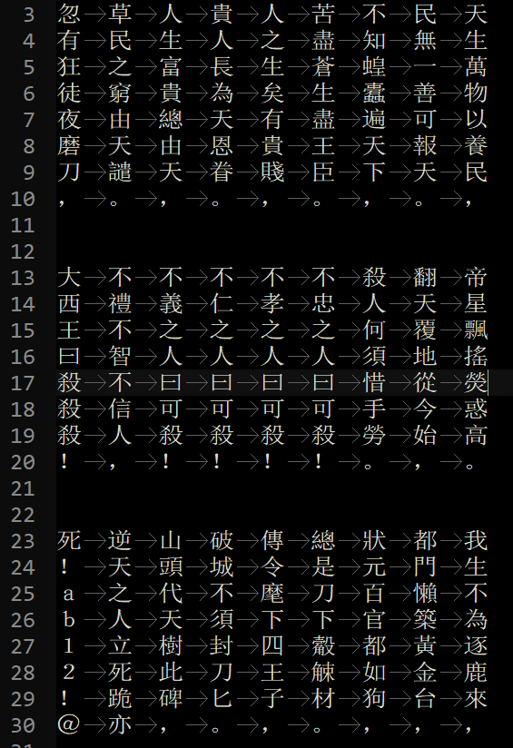

## lua工具

### type.lua

針對librime-lua提供的接口的類型聲明。在編輯器中開啓相關插件(如vscode的lua插件)後可獲得更好的代碼提示和類型檢查。

### ArrayDeque.lua

基于循環數組實現的雙端隊列

### HistoryDeque.lua

繼承ArrayDeque.lua、用于記錄有限個上屏記錄。隊列滿旹 再在隊尾添加元素 則會先使隊頭出隊。


## 方案

### cangjie7-1

魔改三碼倉頡、今僅用于與主方案混輸及作輔助碼

首碼更改:
```
z: 辶
x: 訁
,: 彳
.: 絲
```

非首碼之構件
```
,:也
.:非
```
不足三碼者用`;`補

### hiragana katakana

日語假名。
拼音方案非全同羅馬音、而似IPA音位記音
```
j : /j/
q : っ
l : ー
x : 小寫假名
```
わたしはにんけんじゃない
wa ta si va ni nn ke nn zja na i


### dks

魔改上古音三拼

鍵位圖:

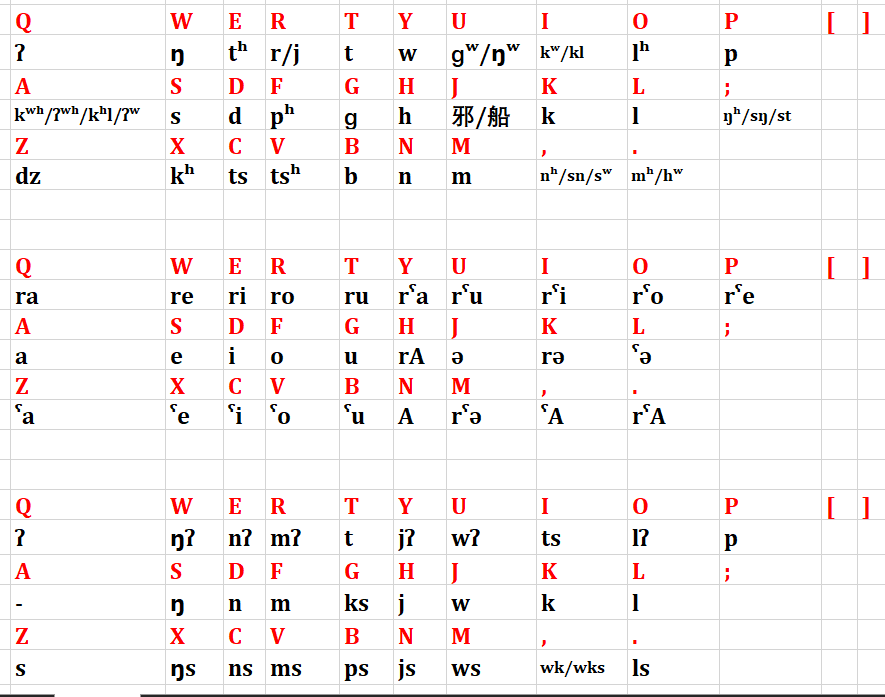

支持cangjie7-1混輸、可選`;`作後綴

支持cangjie7-1作輔助碼

輔助碼用例:

`kya`: /*krˁa/ 候選: 家傢鎵...

若此時欲`鎵`、則添`Co`、即`kyaCo`、緣`鎵`之倉頡碼首碼爲`c`、末碼爲`o`

首碼須大寫(即按住shift後對應的字符)、倉頡末碼可省

`:`: 地球拼音反查 陰平不標、;.,分別對應陽平、上聲、去聲。
`;;`: 倉頡反查
`'`: 輸入平假名
`"`: 輸入片假名

