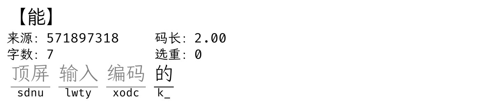
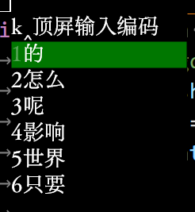
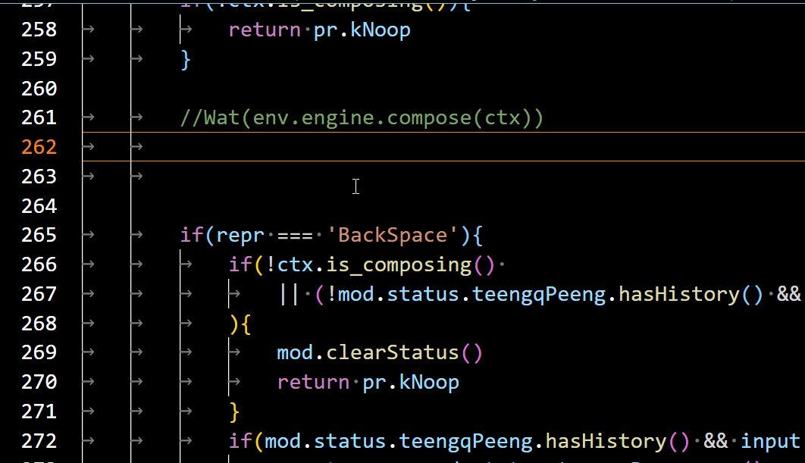

# 定長編碼頂屏


定長4碼方案，第五碼頂字，但是暫時不上屏；繼續輸入編碼，第9碼時，將第5-8碼的字詞頂到跟1-4碼的字詞一起，連成句子，但是依然不上屏；只有當按下選重鍵，或者按下直出的符號鍵時，纔將最末的還未頂屏的編碼進行選重，或者符號頂屏首選，並將前面暫時未上屏的句子一起頂上屏。另外，若按下上屏編碼鍵，則將所有的輸入的編碼上屏，包括上述所說的暫時未上屏的字詞的編碼。





當打到 的 字之前，頂屏 輸入 編碼 這三個詞已經被頂出來了，但是還沒上屏，而我最後輸入 k，並且按下選重鍵（空格），則前三個字詞與輸入的字一起上屏。

而如果當我按完k之後，沒有按選重鍵（空格），而是按下上屏編碼鍵，則上屏sdnulwtyxodck這個編碼。

效果:



下圖潙GIF:




實現之理則:
開一個變量用來存已經頂屏的字及其編碼 、頂屏的時候把已經頂屏的字及編碼存到那個變量裏、然後再把他從輸入框裏刪掉、這樣輸入框裏剩下的就只有未頂屏的字。

## 安裝
假設您要爲example.schema.yaml配置該腳本:

1. 在example.schema.yaml頂層加入以下內容:
```yaml

# 根節點
TswG: {
  # 該模塊節點
  fixedTeengqPeeng: {
    fixedLength: 4 # 固定碼長長度
	# 㕥清除本輪輸入狀態之諸鍵
    ,keyOnClearStatus: [
      'Return'
    ]
	# 㕥提交原始輸入字母之諸鍵。默認用回車鍵。
    ,keyOnCommitRawInput: [
      'Return'
    ]
	# 通過符號鍵等 上屏所有字與符號
    ,keyOnCommitWithKNoop: [
      'comma', 'period'
    ]
  }
}
```

2. 在`engine/processors`列表中新加一個元素`lua_processor@fixedTeengqPeeng_P`、加在所有 非lua組件 之上。如:
```yaml
engine:
  processors:
    - lua_processor@fixedTeengqPeeng_P # lua
    - ascii_composer
    - recognizer
    - key_binder
    # 以下省略...
```

3. 確保`<用戶文件根目錄>/rime.lua`中引入了`fixedTeengqPeeng.lua`模塊。需要有 名爲`fixedTeengqPeeng_P`的全局變量

```lua
local fixedTeengqPeeng = require('TswG.mod.fixedTeengqPeeng')
fixedTeengqPeeng_P = fixedTeengqPeeng.processor
```


4. 重新部署