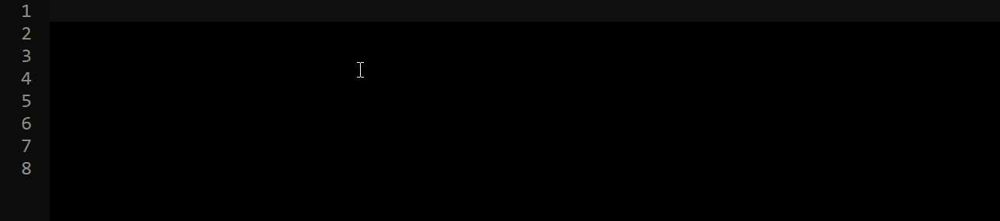
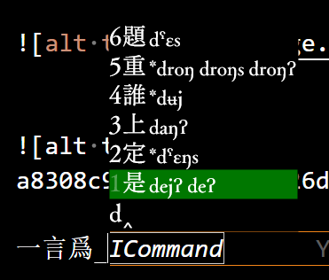

# 聯想詞

含主動聯想與被動聯想。

**此模塊依賴ts_cmd模塊、請先閱讀ts_cmd模塊的說明書**


## 主動聯想

上屏後主動顯示聯想詞

(下圖是gif)




同文:


## 被動聯想

輸入旹、候選詞的詞序根據之前的輸入而調整。

如:

單獨按下「d」鍵、顯示的候選詞順序爲: [是, 長, 着, 廚, 上, 動] :


先輸入「一言爲」三個字後、再按下「d」鍵、可見「定」字排到了候選詞前面。這是因爲聯想詞庫中有「一言爲定」一詞。已經輸入了「一言爲」三字後、再次按下d鍵、「定」字會被賦予更高的權重。

(演示旹、由于此方案同時開啓了其他插件、按下d鍵旹「是」字總是排在首位。)




##

主動聯想與被動聯想均支持動態詞庫。聯想候選的權重會根輸入歷史而動態調整。

同時開關主動聯想與被動聯想的命令:

`$p` 開 - `$P` 關

單獨開啓被動聯想的命令:

`$pp` 開 - `$Pp` 關

單獨開啓主動聯想的命令:

`$ap` 開 - `$Ap` 關


## 安裝與配置

請先閱讀ts_cmd模塊的說明書，並安裝ts_cmd模塊。

配置好ts_cmd後:

在rime.lua中:

```lua
local ts_predict = require("TswG.mod.ts_predict")
ts_predict_P = ts_predict.processor
ts_predict_T = ts_predict.translator
ts_predict_F = ts_predict.filter
```

xxx.schema.yaml中:

```yaml

TswG: {
  ts_predict: {
# charToPush: 顯示主動聯想詞旹 插入的輸入字符。緣rime中 無輸入字符旹 不能憑空出候選。
# 必須爲單個可打印的ascii字符
# 且該字符必須加在speller/alphabet中
    charToPush: '^'
# 用空格鍵清除聯想候選
    ,clearOnSpace: false
# 默認加在所有聯想候選詞列表最後的候選詞。
#當輸入一些生僻字等旹、查詢到的聯想詞可能過少甚至沒有、此時則顯示下面的字。
    ,defaultPredict: ['的','了','嗎','是','不', '呢']
#開關的名字
    ,switchName: 'predict'
    ,activeSwitchName: 'active_predict'
    ,passiveSwitchName: 'passive_predict'
# 顯示候選注釋
    ,showComment: true
# 顯示候選權重
    ,showQuality: false
# 模塊記錄的輸入歷史深度。輸入歷史將用于生成用戶聯想詞、寫入動態詞庫。
# 請勿將請項設定過大、因爲 由輸入歷史生成用戶詞旹涉及O(n^2)的計算量。
    ,commitHistoryDepth: 4
# 主動聯想候選項注釋的前綴。
    ,commentMark: {
      static: '*' # 靜態候選
      ,dynamic: '' # 動態候選
    }
    ,userPredictRecordDbName: 'userPredictRecord.ldb'
#排除的字符、不會進入動態聯想詞庫
    ,excludedChars: "!\"#$%&'()*+,-./0123456789:;<=>?@ABCDEFGHIJKLMNOPQRSTUVWXYZ[\\]^_\`abcdefghijklmnopqrstuvwxyz{|}~"
# 靜態聯想詞ʹ名 及 動態聯想詞ʹ僞方案ʹ名
    ,reverseDbName: 'prd'
# 靜態聯想詞 reverse.bin 路徑、 =後爲程序中設置的默認值
    #,reverseDbPath: = 'build_/'+this.reverseDbName+'.reverse.bin' //靜態聯想詞
  }
}

engine:
  processors:
    - lua_processor@ts_predict_P

  translators:
    - lua_translator@ts_predict_T

  filters:
    - lua_filter@ts_predict_F


```

