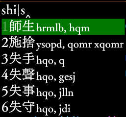

例: 用拼音詞組反查倉頡5:

通過用輸入詞組的拼音來顯示詞組中每個字的形碼的編碼



邏輯是把詞組拆成單字再拿單字去reverseLookup查詢。 比如、對于「完美」一詞、最終顯示出來的樣式是 「完」字的編碼 拼接上 「美」字的編碼。 如果 (  「完美」 兩個字作爲詞組一起打 和 分開打「完」字和「美」字  的編碼不一樣)   那麼 { 這個腳本不能查詢到 作爲詞組一起打 時 的編碼 }

此插件依賴以下文件:
dependencies: [
	module.ts,
	strUt.ts,
	SchemaOpt.ts
]

單獨安裝旹、注意帶上對應的`.lua`文件

rime.lua:

```lua
local phraseReverse = require('TswG.phraseReverse')
phraseReverse_F = phraseReverse.filter
```

## 配置

schema.yaml中

```yaml
# 該插件的配置:
TswG: {
	phraseReverse: {
		effectTag: 'terra_pinyin' # 有此tag旹 生效
		,reverseDbName: 'cangjie5' # 生效旹 comment中逐字顯示的編碼的來源
	}
}
```

假如通過terra_pinyin來反查倉頡5、輸出`:`作爲啓用拼音反查的前綴、則請參考以下配置(部分):

```yaml
engine:
  segmentors:
    - affix_segmentor@terra_pinyin

  translators:
    - script_translator@terra_pinyin

  filters:
    - lua_filter@phraseReverse_F #此插件導出的全局變量的名稱


terra_pinyin:
  tag: terra_pinyin # 此tag要和插件配置中的effectTag一致
  dictionary: terra_pinyin
  prefix: ":" # 
  #suffix: "%"
  tips: 〔普通話〕
  enable_completion: true
  preedit_format:
    - xform/%/|/
    - xform/([nl])v/$1ü/
    - xform/([nl])ue/$1üe/
    - xform/([jqxy])v/$1u/
    - xform/%/|/

recognizer:
  patterns:
    terra_pinyin: "^:[a-z]*.+[^-=0-9]$" # 若匹配到以:開頭則加上terra_pinyin的tag
```